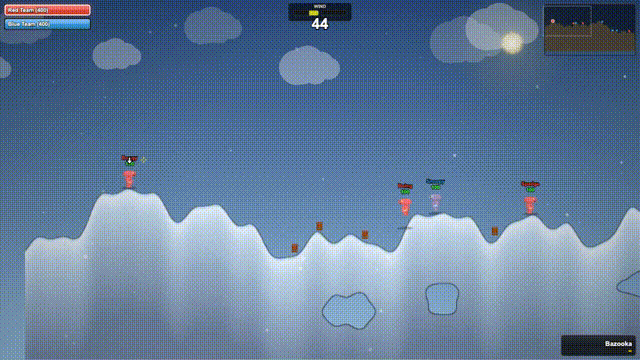

# Worms World Party - Browser Edition

[](https://www.linkedin.com/in/nir-diamant-759323134/)
[](https://twitter.com/NirDiamantAI)
[](https://www.reddit.com/r/EducationalAI/)
[](https://discord.gg/cA6Aa4uyDX)
[](https://github.com/sponsors/NirDiamant)

A browser-based tribute to the classic **Worms World Party** built entirely with vanilla JavaScript and HTML5 Canvas. No frameworks, no build tools, no dependencies — just pure web tech.

## 📫 Stay Updated!

<div align="center">
<table>
<tr>
<td align="center">🚀<br><b>Cutting-edge<br>Updates</b></td>
<td align="center">💡<br><b>Expert<br>Insights</b></td>
<td align="center">🎯<br><b>Top 0.1%<br>Content</b></td>
</tr>
</table>

[](https://diamantai.substack.com/?r=336pe4&utm_campaign=pub-share-checklist)

*Join over 50,000 AI enthusiasts getting unique cutting-edge insights and free tutorials!*
</div>

[](https://diamantai.substack.com/?r=336pe4&utm_campaign=pub-share-checklist)

## Gameplay

[](https://github.com/NirDiamant/worms-world-party/releases/download/v1.0/gameplay.mp4)

*Click the preview above to watch the full 60-second gameplay video*

## Play

```bash
git clone https://github.com/NirDiamant/worms-world-party.git
cd worms-world-party
python3 -m http.server 8080
```

Then open [http://localhost:8080](http://localhost:8080) in your browser.

## Features

- **Full artillery gameplay** — Bazookas, grenades, shotguns, uzis, airstrikes, and more
- **4 terrain themes** — Grassland, Desert, Arctic, Hell — each with unique weather effects
- **Procedural terrain** — Hills, islands, bridges, valleys with destructible landscape
- **AI opponents** — Three difficulty levels (Easy, Medium, Hard)
- **Pixel art sprites** — All characters and entities drawn as pixel art
- **Synthesized audio** — All sound effects generated via Web Audio API
- **Physics engine** — Gravity, wind, knockback, projectile trajectories
- **Ninja Rope** — Swing across the map with pendulum physics
- **Explosive barrels** — Chain-reaction environmental hazards
- **Minimap** — Keep track of the battlefield
- **Post-game stats** — Kills, damage dealt, and team standings
- **Customizable setup** — Team names, worm names, turn time, game schemes

## Controls

| Key | Action |
|-----|--------|
| Arrow Keys | Move / Aim |
| Space | Jump / Fire / Confirm |
| Enter | Backflip / Fire |
| Tab | Cycle weapons |
| 1-9 | Quick-select weapon |
| Mouse | Camera pan (drag) / Zoom (scroll) |

## Tech Stack

- Vanilla JavaScript (ES Modules)
- HTML5 Canvas (5 stacked layers)
- Web Audio API (synthesized sounds)
- Zero dependencies

## Disclaimer

**Worms World Party** is a trademark of Team17. The original game concept, name, and intellectual property belong to their respective creators. This is an unofficial fan-made tribute project created for educational and entertainment purposes. It is not affiliated with or endorsed by Team17.

## Built With

This entire game was built with [Claude Code](https://claude.ai/claude-code) by Anthropic. From terrain generation to AI opponents to synthesized audio — every line of code was written in collaboration with Claude.

There is much to improve and many features still to add. Pull requests are welcome!

Enjoy playing!
